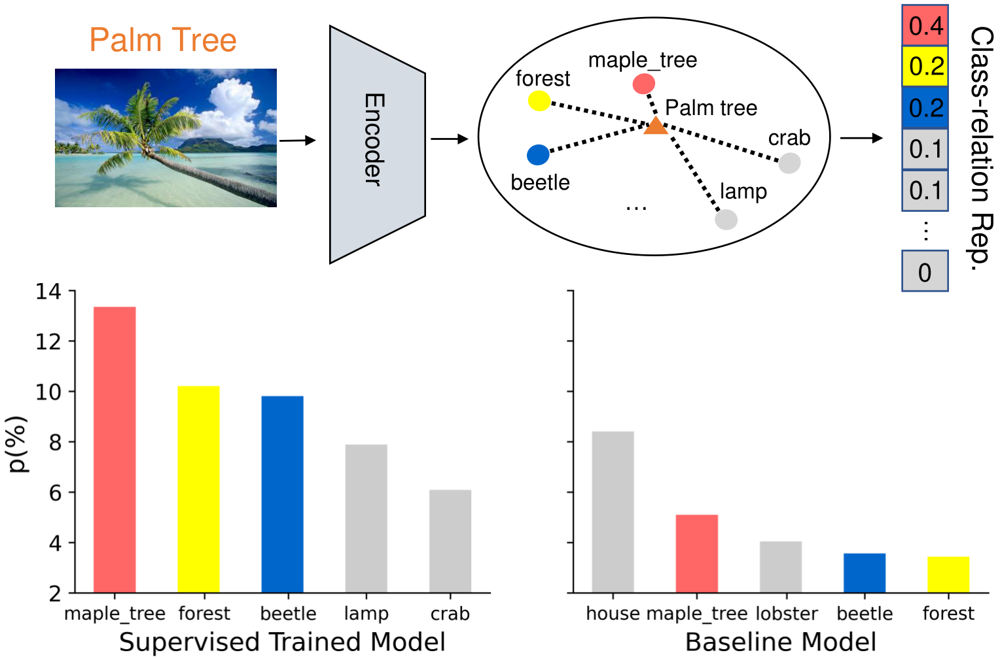
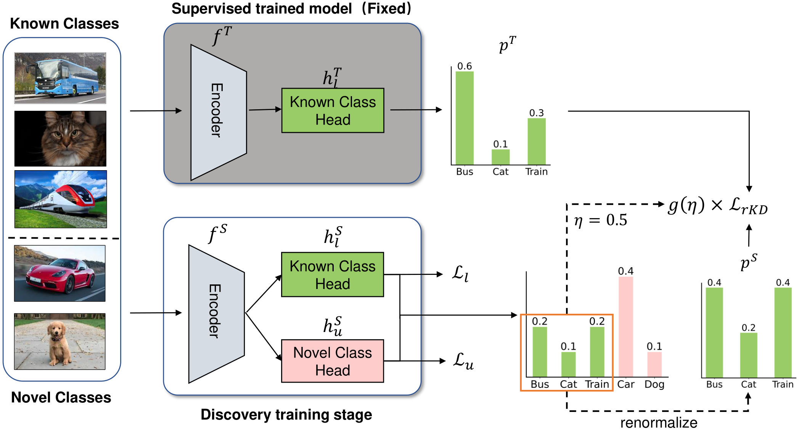

# The official code for "Class-relation Knowledge Distillation for Novel Class Discovery (ICCV2023)"
> Paper link: [Arxiv](https://arxiv.org/abs/2307.09158)
> 
> Class-relation Knowledge Distillation for Novel Class Discovery
> 
> Peiyan Gu*, Chuyu Zhang*, Ruijie Xu, Xuming He
> 
> (The first two authors contribute equally).

>Abstract: We tackle the problem of novel class discovery, which aims to learn novel classes without supervision based on labeled data from known classes. A key challenge lies in transferring the knowledge in the known-class data to the learning of novel classes. Previous methods mainly focus on building a shared representation space for knowledge transfer and often ignore modeling class relations. To address this, we introduce a class relation representation for the novel classes based on the predicted class distribution of a model trained on known classes. Empirically, we find that such class relation becomes less informative during typical discovery training. To prevent such information loss, we propose a novel knowledge distillation framework, which utilizes our class-relation representation to regularize the learning of novel classes. In addition, to enable a flexible knowledge distillation scheme for each data point in novel classes, we develop a learnable weighting function for the regularization, which adaptively promotes knowledge transfer based on the semantic similarity between the novel and known classes. To validate the effectiveness and generalization of our method, we conduct extensive experiments on multiple benchmarks, including CIFAR100, Stanford Cars, CUB, and FGVC-Aircraft datasets. Our results demonstrate that the proposed method outperforms the previous state-of-the-art methods by a significant margin on almost all benchmarks.

<!-- <style>
figure {
  text-align: center;
}

figcaption {
  display: block;
  margin: 0 auto;
}
</style> -->

<br>
<p align="center">
     <br />
    <em>
    The motivation of our method
    </em>
</p>
<br>
<p align="center">
     <br />
    <em>
    Overview of the proposed architecture.
    </em>
</p>
<br>

## Installation

Our implementation is based on pytorch, you can setup the environment by conda:

```
conda env create -f env.yaml
```

## Datasets
You have to download the CIFAR100, Stanford Cars, CUB, FGVC-Aircraft datasets from their website, and write their path to **config.py**.

## Training
We log the training by wandb. You have to fill in your wandb key in **utils/parse.py(line 111)**.

### Supervised Training
Before discover novel classes, we first train the model on the known classes. For CIFAR100 dataset, you can directly train the model by following scripts:

```
python rKD.py --c pretrain_cifar.yaml
```

For three fine-grained datasets, you have to first download the unsupervise pretrained ViT-B16 model from [DINO's](https://github.com/facebookresearch/dino) repo. And then finetune the model by:

```
python rKD.py --c pretrain_vit_aircraft.yaml
python rKD.py --c pretrain_vit_cub.yaml
python rKD.py --c pretrain_vit_scars.yaml
```

After you finish the supervised training, you have to modify the **pretrained_path** in **script/discover_{dataset name}.yaml** to your pretrain path.

### Discovery training stage:
Run following scripts to discover novel classes:

```
python rKD.py --c scripts/discover_vit_{dataset name}.yaml
```

*We encourage you to do research on finegrained dataset which is more realistic and challenging. In addition, you can try the more challenging general category discovery setting.*

### Acknowledgement
We thank the codebase provided by [UNO](https://github.com/DonkeyShot21/UNO) and [GCD](https://github.com/sgvaze/generalized-category-discovery).

## Citation

If you find our work is useful, please cite our paper:
```
@InProceedings{peiyan2023class,
    author    = {Peiyan Gu, Chuyu Zhang, Ruijie Xu,Xuming He},
    title     = {Class-relation Knowledge Distillation for Novel Class Discovery},
    booktitle = {Proceedings of the IEEE/CVF International Conference on Computer Vision (ICCV)},
    year      = {2023}
}
```